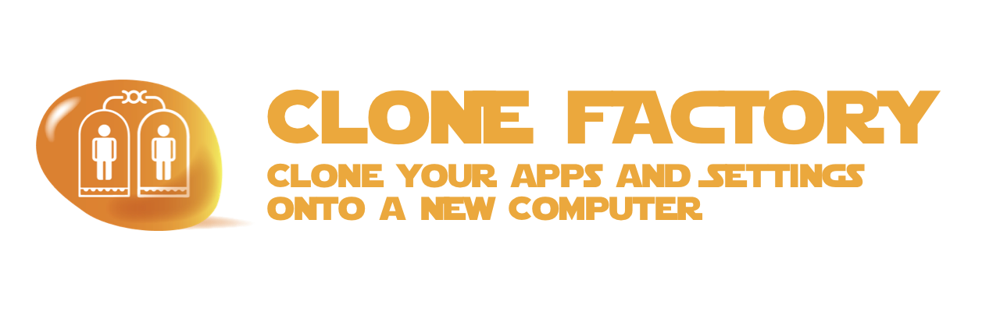

# clonefactory



> **THIS PROJECT IS STILL IN THE DESIGN PHASE**
>
> IDEAS & CONTRIBUTIONS ARE WELCOME
>
> An [Open Source Universe](https://github.com/intellibus/approach) Project

---

## Contents

- [clonefactory](#clonefactory)
  - [Contents](#contents)
  - [Features ✨](#features-)
  - [Install 🛠](#install-)
  - [Usage 🔭](#usage-)
  - [Documentation 🛰](#documentation-)
  - [Contributing 🌎](#contributing-)
  - [License ⚖️](#license-️)

## Features ✨

- Save your apps, settings, & dotfiles to BigParser  `Planned`
- Load your apps, settings, & dotfiles to BigParser  `Planned`
- Sync your apps, settings, & dotfiles between Computers  `Planned`
- Cross-Platform Linux, MacOS, & Windows Support `Planned`

## Install 🛠

```sh
npm install clonefactory
```

## Usage 🔭

Read more about the [Design](https://github.com/intellibus/clonefactory/blob/main/DESIGN.md) behind `clonefactory` here.

```sh
$ clonefactory save

Saving to BigParser...
Your Apps and Settings have been saved

$ clonefactory load

Loading from BigParser...

Your Apps and Settings have been cloned onto this machine

$ clonefactory sync
Setting up syncing daemon...
Your Apps and Settings are now syncing live with BigParser

```

## Documentation 🛰

`clonefactory` *is under active development, documentation will be added once an initial release is ready.*

## Contributing 🌎

We would love for you to contribute your ideas, code, & fixes to `clonefactory`.

We encourage everyone to read our [Design Document](https://github.com/intellibus/clonefactory/blob/main/DESIGN.md) to learn more about the thought process behind clonefactory.

Also check out the [rewards](https://github.com/intellibus/approach/blob/main/REWARDS.md) offered for contributing to the [Open Source Universe](https://github.com/intellibus/approach).

## License ⚖️

MIT
